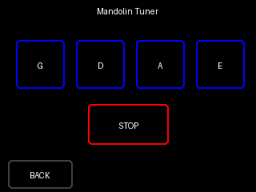

# Taktinator Pro with MandoTouch

A versatile metronome for my favourite mandolin player, based on the **ESP32-Cheap-Yellow-Display (CYD)**, featuring a custom Mandolin-themed UI.

## Support my projects

If you like this project, consider a tip. Your tip motivates me to continue developing useful stuff for the DIY community. Thank you very much for your support!

[](https://ko-fi.com/D1D01HVT9A)

## Features
- **BPM Range:** 40 - 250 BPM (Standard Metronome Range).
- **Mandolin Tuner:** Built-in tuner with reference tones for G, D, A, E strings.
- **Controls:**
  - **Linear Slider:** Quickly swipe to set approximate tempo.
  - **Fine Tune Buttons:** Adjust tempo by +/- 1 or +/- 10 BPM.
  - **Volume Control:** On-screen volume adjustment.
- **Visuals:**
  - **MandoTouch Button:** A custom-drawn Mandolin icon serves as the Start/Stop button.
  - **Status Indication:** Button changes color (Green = Ready, Red = Playing) and animates on touch.
- **Audio:** 
  - High-quality I2S Audio output.
  - **Default Sounds:** Classic Metronome (Woodblock style).

## User Interface

| Main Screen | Sound Select |
|:---:|:---:|
|  |  |
| **Program Select** | **Program Editor** |
|  |  |
| **Mandolin Tuner** | |
|  | |

## Hardware
- **Board:** ESP32-2432S028R (Cheap Yellow Display)
- **Audio:** I2S (MAX98357A) or Internal DAC (GPIO 26)
- **Touch Controller:** XPT2046 (VSPI)
- **Display Driver:** ILI9341 (HSPI)

## Pin Configuration (CYD)

### Display (ILI9341 - HSPI)
- **SCK:** GPIO 14
- **MOSI:** GPIO 13
- **MISO:** GPIO 12
- **CS:** GPIO 15
- **DC:** GPIO 2
- **Backlight:** GPIO 21

### Touch (XPT2046 - VSPI)
- **CLK:** GPIO 25
- **MOSI:** GPIO 32
- **MISO:** GPIO 39
- **CS:** GPIO 33
- **IRQ:** GPIO 36

### Audio (I2S - MAX98357A)
*Default Configuration (defined in `SoundManager.h`)*
- **BCLK:** GPIO 27 (CN1 Header)
- **LRCK:** GPIO 1 (TX Pin - P1 Header)
- **DIN:** GPIO 3 (RX Pin - P1 Header)

*Note: If using Internal DAC (comment out `USE_I2S_AUDIO`), use GPIO 26.*

## Installation

1. **Prerequisites:**
   - Visual Studio Code
   - PlatformIO Extension

2. **Setup:**
   - Connect your ESP32-CYD to your computer via USB.

3. **Upload Firmware:**
   Run the following command in the PlatformIO terminal to build and upload the code:
   ```bash
   pio run -t upload
   ```

4. **Upload Sound Files:**
   The sound files (WAV) are stored in the `data` folder and must be uploaded to the ESP32's filesystem (LittleFS). Run:
   ```bash
   pio run -t uploadfs
   ```

5. **Ready:**
   Tap the Mandolin to start the beat!

## License

This project is licensed under the **PolyForm Noncommercial License 1.0.0**.

- **Noncommercial Use**: You may use this software for personal, educational, or evaluation purposes.
- **Commercial Use Restricted**: You may NOT use this software for commercial purposes (selling, paid services, business use) without prior written consent.

<details>
<summary>View Full License Text</summary>

### PolyForm Noncommercial License 1.0.0

#### 1. Purpose
This license allows you to use the software for noncommercial purposes.

#### 2. Agreement
In order to receive this license, you must agree to its rules. The rules of this license are both obligations (like a contract) and conditions to your license. You must not do anything with this software that triggers a rule that you cannot or will not follow.

#### 3. License Grant
The licensor grants you a copyright license for the software to do everything you might do with the software that would otherwise infringe the licensor's copyright in it for any permitted purpose. However, you may only do so to the extent that such use does not violate the rules.

#### 4. Permitted Purpose
A purpose is a permitted purpose if it consists of:
1. Personal use
2. Evaluation of the software
3. Development of software using the software as a dependency or evaluation tool
4. Educational use

**Commercial use is strictly prohibited without prior written consent from the author.**

#### 5. Rules

##### 5.1. Noncommercial Use
You must not use the software for any commercial purpose. A commercial purpose includes, but is not limited to:
1. Using the software to provide a service to third parties for a fee.
2. Selling the software or a derivative work.
3. Using the software in a commercial environment or business workflow.

##### 5.2. Notices
You must ensure that anyone who gets a copy of any part of the software from you also gets a copy of these terms or the URL for them above, as well as copies of any copyright notice or other rights notice in the software.

#### 6. Disclaimer
**THE SOFTWARE IS PROVIDED "AS IS", WITHOUT WARRANTY OF ANY KIND, EXPRESS OR IMPLIED, INCLUDING BUT NOT LIMITED TO THE WARRANTIES OF MERCHANTABILITY, FITNESS FOR A PARTICULAR PURPOSE AND NONINFRINGEMENT.**

</details>

