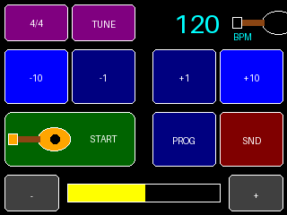
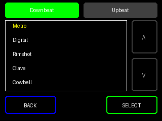
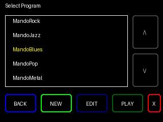
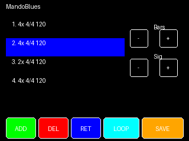

# Taktinator Pro with MandoTouch

A versatile metronome for my favourite mandolin player, based on the **ESP32-Cheap-Yellow-Display (CYD)**, featuring a custom Mandolin-themed UI.

## Support my projects

If you like this project, consider a tip. Your tip motivates me to continue developing useful stuff for the DIY community. Thank you very much for your support!

[](https://ko-fi.com/D1D01HVT9A)

## Features
- **BPM Range:** 40 - 208 BPM (Standard Metronome Range).
- **Controls:**
  - **Linear Slider:** Quickly swipe to set approximate tempo.
  - **Fine Tune Buttons:** Adjust tempo by +/- 1 or +/- 10 BPM.
  - **Volume Control:** On-screen volume adjustment.
- **Visuals:**
  - **MandoTouch Button:** A custom-drawn Mandolin icon serves as the Start/Stop button.
  - **Status Indication:** Button changes color (Green = Ready, Red = Playing) and animates on touch.
- **Audio:** Generates a crisp 1kHz click sound (50ms duration) on each beat.

## User Interface

| Main Screen | Sound Select |
|:---:|:---:|
|  |  |
| **Program Select** | **Program Editor** |
|  |  |

## Hardware
- **Board:** ESP32-2432S028R (Cheap Yellow Display)
- **Audio:** I2S (MAX98357A) or Internal DAC (GPIO 26)
- **Touch Controller:** XPT2046 (VSPI)
- **Display Driver:** ILI9341 (HSPI)

## Pin Configuration (CYD)

### Display (ILI9341 - HSPI)
- **SCK:** GPIO 14
- **MOSI:** GPIO 13
- **MISO:** GPIO 12
- **CS:** GPIO 15
- **DC:** GPIO 2
- **Backlight:** GPIO 21

### Touch (XPT2046 - VSPI)
- **CLK:** GPIO 25
- **MOSI:** GPIO 32
- **MISO:** GPIO 39
- **CS:** GPIO 33
- **IRQ:** GPIO 36

### Audio (I2S - MAX98357A)
*Default Configuration (defined in `SoundManager.h`)*
- **BCLK:** GPIO 27 (CN1 Header)
- **LRCK:** GPIO 1 (TX Pin - P1 Header)
- **DIN:** GPIO 3 (RX Pin - P1 Header)

*Note: If using Internal DAC (comment out `USE_I2S_AUDIO`), use GPIO 26.*

## Installation

1. **Prerequisites:**
   - Visual Studio Code
   - PlatformIO Extension

2. **Setup:**
   - Connect your ESP32-CYD to your computer via USB.

3. **Upload Firmware:**
   Run the following command in the PlatformIO terminal to build and upload the code:
   ```bash
   pio run -t upload
   ```

4. **Upload Sound Files:**
   The sound files (WAV) are stored in the `data` folder and must be uploaded to the ESP32's filesystem (LittleFS). Run:
   ```bash
   pio run -t uploadfs
   ```

5. **Ready:**
   Tap the Mandolin to start the beat!

